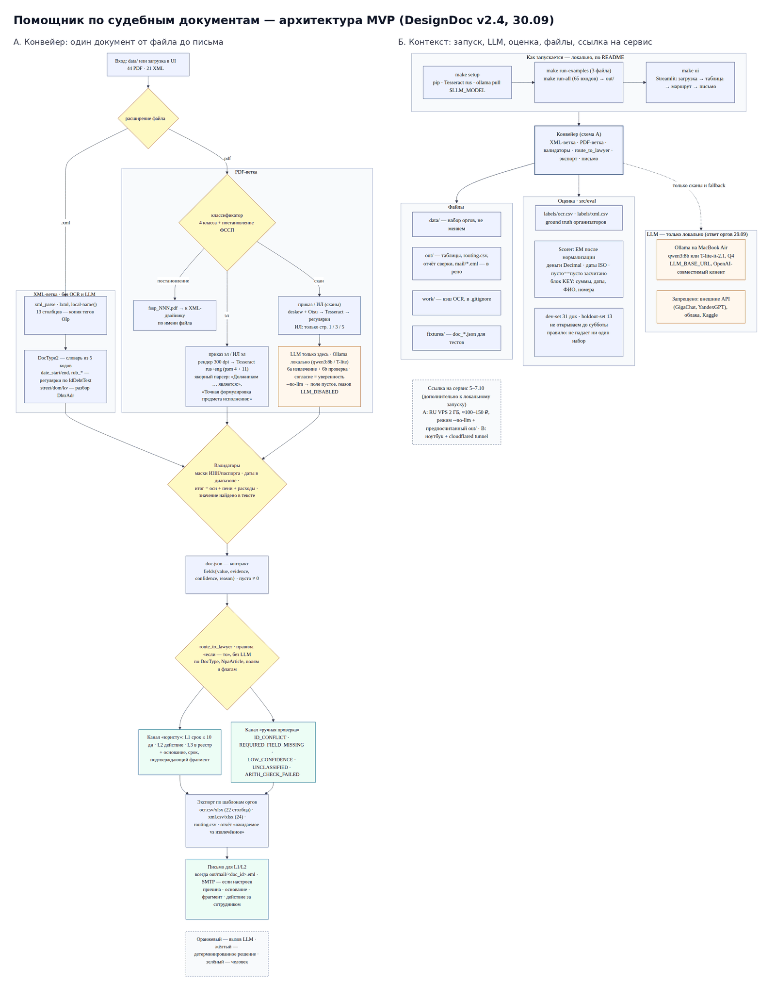

# Хакатон «ИИ-ассистенты для энергетики» 2026. 
Команда: AAATeam

# Задача – Помощник по судебным документам (OCR и извлечение данных)

Принимает судебные приказы, исполнительные листы, постановления ФССП (PDF/XML) и судебные акты, извлекает реквизиты в таблицы по шаблонам заказчика, решает, какие документы требуют работы юриста, и готовит письмо ответственному сотруднику — с основанием, сроком и цитатой из документа.

Версия: `v0.1`.


## Сервис

LLM – `qwen3:8b` развёрнута на арендованном GPU-сервере в РФ (T4 immers.cloud); open-source, без внешних API

Ссылка на сервис: http://195.209.210.12:8501

## Как пользоваться сервисом 
Логин не нужен. Модель qwen3:8b работает на GPU-сервере (T4, РФ), внешние API не используются.

1. Проверить на исходных данных без загрузки файлов: вкладка «Папка документов» → путь data/courts_anonymized/ocr/orders_scan (сканы приказов) или data/courts_anonymized/fssp (XML ФССП) или data/acts (судебные акты) → «Обработать». Для каждого документа — таблица реквизитов, маршрут L1/L2/L3 с основанием и письмо.
2. Свой документ: вкладка «Документ» → загрузить PDF или XML → «Обработать». Тумблер «Без LLM» в сайдбаре — только правила (быстро); с LLM пустые поля дозаполняет модель с проверкой цитаты по тексту (сканы — до 20–30 с).
3. Письмо: в поле «Ответственный сотрудник» укажите свой e-mail и нажмите «Отправить» — придёт письмо с исходным документом и строкой таблицы во вложении. Без адреса письмо сохраняется как .eml и доступно для скачивания.
4. Реестр — всё обработанное: уровень, флаги проверки, статус письма. Качество — метрики на разметке организаторов (44 документа, hold-out 13).

## Быстрый старт

Требования: 
Python 3.10 + (проверено на 3.12), Tesseract с языком `rus`;

Ollama на macOS: сервер работает, пока открыто приложение Ollama; без него пайплайн работает на правилах (--no-llm или просто предупреждение в логе);

 ~2 ГБ на диске без модели, +5 ГБ с моделью `qwen3:8b`.

**Через Makefile (macOS / Linux / Windows с make):**

```bash
git clone <url> && cd <repo>
make setup          # venv, зависимости, проверка Tesseract/Ollama, подтягивает модель, если Ollama запущена
make check          # что найдено: Python, Tesseract rus, Ollama
make test           # pytest
make run-examples   # 3 эталонных документа из fixtures/ → out/examples/
make run-all        # все документы из data/ → out/
make ui             # Streamlit на http://localhost:8501
```

**Вручную, без make:**

```bash
# macOS / Linux
python3.12 -m venv .venv && source .venv/bin/activate
pip install -r requirements.txt
cp .env.example .env
python scripts/check_env.py --pull-model qwen3:8b
pytest -q
python run_examples.py --docs fixtures --out out/examples
python run_examples.py --docs data --out out
streamlit run src/ui/app.py
```

```powershell
# Windows (PowerShell)
py -3.12 -m venv .venv; .venv\Scripts\Activate.ps1
pip install -r requirements.txt
copy .env.example .env
python scripts\check_env.py --pull-model qwen3:8b
pytest -q
python run_examples.py --docs fixtures --out out\examples
python run_examples.py --docs data --out out
streamlit run src\ui\app.py
```

Без LLM: `python run_examples.py --no-llm …` или `NO_LLM=1` в `.env`. Настройки — в `.env` (см. `.env.example`): `LLM_BASE_URL`, `LLM_MODEL`, `DATA_ROOT`, `TESSERACT_CMD`, почта. LLM_BASE_URL / LLM_API_KEY — адрес и ключ любого OpenAI-совместимого сервера с моделью; по умолчанию локальная Ollama. На macOS сервер Ollama работает, пока открыто приложение; без него пайплайн работает на правилах.

**Tesseract.** Linux: `apt install tesseract-ocr tesseract-ocr-rus`. Windows: установщик UB Mannheim, при установке отметить Russian, путь к `tesseract.exe` — в `TESSERACT_CMD`. macOS 13+: `brew install tesseract tesseract-lang`. macOS ≤ 12 (Homebrew без готовых сборок): `conda create -n ocr -c conda-forge tesseract`, затем `TESSERACT_CMD=~/miniforge3/envs/ocr/bin/tesseract` в `.env`.


Результат прогона: `out/ocr.csv`, `out/xml.csv` (столбцы ровно по шаблонам заказчика), `out/routing.csv` (решение по каждому документу), `out/mail/*.eml` (письма), `out/doc_*.json` (полный результат по документу с цитатами), `out/report.md`.


## Что умеет / что не умеет

| Умеет                                                                                   | Не умеет / ограничения                                                      |
| :-------------------------------------------------------------------------------------- | :-------------------------------------------------------------------------- |
| XML постановлений ФССП → 24 столбца шаблона, без OCR и LLM                              | Рукописный текст и печати не распознаёт                                     |
| PDF: электронные (текстовый слой) и сканы (deskew → Tesseract)                          | Качество на сканах ниже, чем на электронных — см. метрики                   |
| 4 типа документов + судебные акты (5-й класс)                                           | Многостраничные сканы с перепутанным порядком страниц не чинит              |
| Правила + локальная LLM (Ollama, `qwen3:8b`) только для полей, которые не нашли правила | Внешние API не используются; LLM опциональна и медленнее правил             |
| Маршрутизация L1/L2/L3 + отдельный канал ручной проверки                                | Юридическое решение не принимает — только рекомендует                       |
| Письмо с причиной, основанием, сроком, цитатой и двумя вложениями                       | Отправка — через SMTP (Яндекс), без SMTP письма сохраняются как `.eml`      |
| Судебные акты: отбор «направить юристу / нет» по 10 фразам заказчика                    | Реквизиты из актов в таблицу не извлекает — по условиям задачи не требуется |

## Данные

Набор организаторов: постановления ФССП (XML + PDF-двойник, 5 кодов оснований), судебные приказы и исполнительные листы (электронные PDF и сканы), эталонная разметка `labels/` и шаблоны таблиц `templates/`; отдельно — 11 судебных актов с перечнем фраз для направления юристу.

```
data/
  courts_anonymized/   # основной набор: fssp/, ocr/, labels/, templates/, manifest.json
  acts/                # 11 судебных актов + «Фразы и примеры.csv»
fixtures/              # 3 эталонных doc.json, собраны из labels/ (method: gold) — для тестов и демо
```

Разметка `labels/` — эталон для метрик; 13 файлов отложены как hold-out и не используются при настройке правил и промптов. Поля `дело_номер`/`дело_дата` в судебных актах пусты: в выборке они замаскированы (`[дело]`, `[дата]`). Расхождения между разметкой и текстом документа фиксируются в `docs/discrepancies.md` и не подгоняются.

## Как это работает



1. **Классификация.** Судебный акт — по текстовому слою (`looks_like_court_act`); остальные PDF — 4 класса (приказ/ИЛ × электронный/скан); постановление ФССП в PDF берётся из XML-двойника.
2. **XML-ветка.** `lxml, поля fssp:OIp → 24 столбца; суммы и период — регулярками из текста требования, LLM только как запасной вариант, если регулярки не разобрали текст.
3. **PDF-ветка.** Электронный — текстовый слой + якоря; скан — deskew/Otsu → Tesseract → регулярки. Пустые поля дозаполняет локальная LLM (`regex_first`: совпали — берём правило, разошлись — флаг `LOW_CONFIDENCE`). Значения от LLM нормализуются кодом (даты → ГГГГ-ММ-ДД, суммы → точка и два знака) и принимаются только с цитатой, найденной в тексте.
4. **Валидация.** ИНН, даты, суммы (арифметика), обязательные поля → `route.review.flags`.
5. **Маршрутизация.** Правила по кодам оснований и фразам актов → `route.lawyer` (уровень, коды, норма, срок, цитата).
6. **Экспорт.** Единый контракт `doc.json` → `ocr.csv`/`xml.csv`/`routing.csv`, письмо `.eml`, реестр, отчёт.

Контракт `doc.json`: каждое поле — `value`, `confidence`, `method` (`regex` / `llm` / `xml` / `gold`), `evidence` (цитата из текста). Пустое значение без причины контрактом запрещено.

## Результаты

Прогон всех 44 размеченных документов правилами, без LLM ( `python run_examples.py --docs data --out out --no-llm` ), сравнение с разметкой организаторов после нормализации. KEY — `суммы`, `даты`, `ФИО`, `номера дел/ИП`.

| Срез | Док. | Ячейки, точное совпадение | KEY-реквизиты | Документов без ошибок |
|---|---|---|---|---|
| XML ФССП | 21 | 99,8 % | 99,7 % | 20/21 |
| PDF электронные | 13 | 78,8 % | 78,6 % | 0/13 |
| PDF сканы | 10 | 61,4 % | 60,0 % | 0/10 |
| **Hold-out (13, не использовались при настройке)** | 13 | 86,7 % | 88,4 % | 6/13 |
| Все | 44 | 85,5 % | 87,6 % | 20/44 |

По PDF правила надёжно берут номер дела, ФИО (87 %), паспорт (91 %), дату рождения (83 %), периоды (91 %), основной долг (87 %), ИНН; слабые места — адрес (формат), дата решения на сканах, пени и список соответчиков. Эти поля дозаполняет LLM с проверкой каждой цитаты по тексту; на ноутбуке без GPU (`qwen3:8b`, M1) это ~270 с на документ, поэтому метрики выше — по правилам; в сервисе по ссылке LLM работает на GPU-сервере. Время обработки правилами: XML < 0,1 с, электронный PDF 1–8 с, скан 4–13 с.

Разбор ошибок и «ожидаемое vs извлечённое» — `out/report.md`.

## Письмо юристу

Уровни: **L1** — есть срок ≤ 10 дней (акты: ≤ 15 дней или назначенная дата); **L2** — действие нужно, срочного срока нет; **L3** — только реестр. Отдельно — канал ручной проверки (`review.flags`: низкая уверенность, не извлечены обязательные реквизиты, противоречия, арифметика не сходится).

Письмо уходит для L1/L2 и для документов с флагами проверки. Тема: `[L2] Проверка по делу № … — тип — срок до …`. Тело — 4 коротких абзаца: причина направления словами, основание и срок, цитата из документа, напоминание, что решение за сотрудником. Вложения: исходный документ и строка таблицы с результатами (`<doc_id>_row.csv`). Письма — out/mail/ после прогона.

Судебные акты: решение «направить юристу / нет» по 10 фразам заказчика, ищутся только в резолютивной части; срок — из текста акта («в течение месяца», «в срок до …»); норма — из «Руководствуясь статьями … АПК РФ».

Отправка через SMTP (проверено на Яндекс.Почте); без SMTP письма сохраняются как .eml. Отправитель — MAIL_FROM в формате "Имя <адрес>".

Адрес получателя задаётся в LAWYER_EMAIL (.env); при запуске из репозитория укажите свой адрес и параметры своего SMTP (пример — в .env.example), без SMTP письмо сохраняется как .eml в out/…/mail/ и доступно для скачивания в интерфейсе.

## Структура репозитория

```
run_examples.py        # точка входа: документы → doc.json → таблицы, письма, реестр, отчёт
Makefile, pytest.ini   # make setup / test / run-examples / run-all / score / report / ui
.env.example           # настройки: LLM, Tesseract, почта (копировать в .env)
prompts/               # scan_extract.md, scan_verify.md, xml_fallback.md — тексты промптов LLM
src/
  core/                # контракт doc.json, столбцы шаблонов заказчика
  xmlbranch/           # XML постановлений ФССП → 24 столбца
  pdf_branch/          # классификатор, OCR (deskew → Tesseract), правила извлечения (ner/), склейка в doc.json (services/to_doc.py)
  acts/                # судебные акты: резолютивная часть, фразы заказчика
  rules/               # маршрутизация L1/L2/L3, коды оснований, тексты для письма, маркеры актов
  llm/                 # клиент OpenAI-совместимого сервера (Ollama / GPU), схемы ответа
  export/              # csv по шаблонам, письмо .eml/SMTP, реестр
  eval/                # scorer, отчёт сверки, нормализация, hold-out
  ui/                  # Streamlit: документ, папка, реестр, качество
scripts/               # check_env.py (окружение, модель), make_fixtures.py
tests/, fixtures/      # pytest (145 тестов), 4 эталонных doc.json
data/                  # courts_anonymized/ (fssp, ocr, labels, templates, holdout.txt), acts/
out/                   # результаты полного прогона: ocr.csv, xml.csv, routing.csv, registry.csv, metrics.md, report.md, diff.xlsx
docs/                  # architecture_v2.4.png, discrepancies.md, presentation_outline.md, video_storyboard.md
```